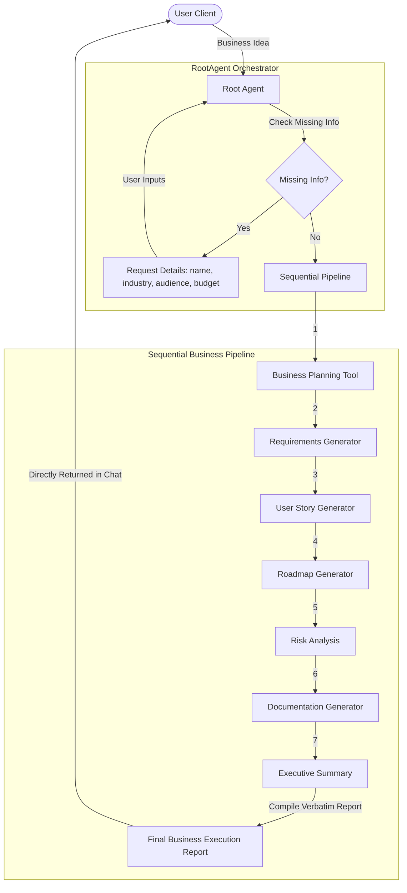

# SprintPilot AI 🚀
### AI-powered Business Planning and Project Execution Assistant

[](#)
[](#)
[](#)
[](#)

---


---

## Project Overview

SprintPilot AI is an intelligent AI assistant that helps entrepreneurs, startups, ecommerce businesses and software teams transform business ideas into structured execution plans using Google Agent Development Kit (ADK), Gemini and FastAPI. It replaces manual planning overhead by automatically orchestrating specialized operational tools to produce single, unified, production-ready reports directly in the user chat interface.

---

## Problem Statement

Transitioning a raw startup idea into an organized technical blueprint is a slow, fragmented process. Product teams and founders spend weeks manually syncing business outlines, software requirement specifications (SRS), user stories, roadmaps, risk matrices, and executive summaries. This creates a massive administrative bottleneck and leads to communication gaps between business strategy and actual engineering implementation.

---

## Solution

SprintPilot AI bridges this gap with an autonomous pipeline. When given a high-level business concept, SprintPilot AI checks for parameter completeness (Business Name, Industry, Target Audience, Budget) and automatically runs a sequential execution loop. It orchestrates business design, requirements engineering, timeline Scheduling, and risk mitigation tools to return a single, structured, verbatim Operations and Execution Report.

---

## Key Features

*   **Autonomous Chaining:** Automatically executes planning, roadmap, risk, and summary tools sequentially in one turn.
*   **Stateful Memory Preservation:** Recalls project names, target sectors, and previous timelines across sessions.
*   **Verbatim Document Outputs:** Outputs full generated reports directly to the user client interface without abbreviation or truncation.
*   **Extensible Model Context Protocol (MCP):** Connects natively with Filesystem, GitHub, Google Drive, Docs, and Calendar to deploy planning outputs.
*   **Live Visual Log Status:** Visualizes pipeline step execution using emojis in the logs.

---

## Architecture Overview

The system diagram below displays how user inputs route to the backend, run the sequential agent graph, and interface with memory and MCP services:




---

## Business Workflow

The sequential execution workflow follows these precise stages:
1.  **User Input:** Submits business concept in raw text.
2.  **SprintPilot Root Agent:** Checks parameters. If details are missing, prompts user.
3.  **Business Planning Tool:** Formulates market placement and value proposition.
4.  **Requirements Generator:** Generates technical requirements (PRD).
5.  **User Story Generator:** Drafts Scrum user stories with acceptance criteria.
6.  **Roadmap Generator:** Formulates timeline, epics, priorities, and deliverables.
7.  **Risk Analysis:** Identifies legal, technical, financial, and operational risks.
8.  **Documentation Generator:** Compiles technical references and code structure outlines.
9.  **Executive Summary:** Synthesizes high-level metrics for investors and stakeholders.
10. **Final Business Execution Report:** Delivers the verbatim output in markdown formatting.

---

## AI Business Tools

*   `generate_business_plan`: Formulates value propositions and market segments.
*   `generate_project_requirements`: Formulates full engineering specifications.
*   `generate_user_stories`: Drafts Scrum stories with target objectives.
*   `create_project_roadmap`: Determines phased timeline charts and priorities.
*   `analyze_business_risks`: Evaluates compliance and severities.
*   `generate_documentation`: Compiles system architectures and READMEs.
*   `create_executive_summary`: Synthesizes investor briefs.
*   `execute_business_planning_workflow`: Core controller tool that runs the pipeline.

---

## Technology Stack

*   **Logic Framework:** Google Agent Development Kit (ADK) 2.0
*   **AI Engine:** Gemini 2.5 Flash Lite (optimized for speed and free-tier request limits)
*   **Server Backend:** FastAPI, Uvicorn
*   **Environment & Package Manager:** uv
*   **Data Validation:** Pydantic v2

---

## Folder Structure

```text
sprintpilot-ai/
├── app/
│   ├── app_utils/
│   │   ├── mcp_client.py                 # MCP client manager
│   │   ├── reasoning_engine_adapter.py    # FastAPI server interface
│   │   └── telemetry.py                  # Telemetry configuration
│   ├── tools/
│   │   ├── __init__.py                   # Tools package exposure
│   │   ├── business_plan.py              # Business planning logic
│   │   ├── business_risks.py             # Risk analysis tool
│   │   ├── documentation.py              # Documentation compiler
│   │   ├── executive_summary.py          # Executive VC synthesis
│   │   ├── orchestrator_workflow.py      # Core sequential pipeline runner
│   │   ├── project_requirements.py       # Requirements specification extractor
│   │   ├── project_roadmap.py            # Epic timeline scheduler
│   │   └── user_stories.py               # Scrum story card generator
│   ├── agent.py                          # RootAgent definitions
│   ├── config.py                         # Environment variables mapping
│   └── main.py                           # FastAPI entrypoint
├── assets/
│   ├── architecture_diagram.png          # System architecture visualizer
│   └── cover_page_banner.png             # Project title banner
├── tests/
│   ├── integration/                      # Agent interface tests
│   └── unit/                             # Test frameworks
├── pyproject.toml                        # Project config & dependencies
└── README.md                             # Project documentation
```

---

## Installation & Running Locally

1.  **Clone Repository:**
    ```bash
    git clone https://github.com/uicoder1/sprintpilot-ai.git
    cd sprintpilot-ai
    ```
2.  **Set Up Local Env:**
    Copy `.env.example` to `.env` and fill in your keys:
    ```env
    GOOGLE_API_KEY=your_gemini_api_key_here
    GEMINI_API_KEY=your_gemini_api_key_here
    GEMINI_MODEL=gemini-2.5-flash-lite
    ```
3.  **Install dependencies:**
    ```bash
    make install
    ```
4.  **Run Playground Server:**
    ```bash
    make playground
    ```
    Access the playground interface at: [http://localhost:18081/dev-ui/?app=app](http://localhost:18081/dev-ui/?app=app)

---

## Example Prompt

```text
I want to build a software consultancy startup named DevSprint in the SaaS industry. Our target audience is enterprise software buyers, and our initial budget is $50,000.
```

---

## Example Output

```markdown
# SPRINT PILOT OPERATIONS REPORT: DEVSPRINT
**Industry Sector:** SaaS
**Target Audience:** Enterprise software buyers
**Initial Budget/Funding:** $50,000

---

## Executive Summary
This document synthesizes the operational design and engineering rollout schedule for DevSprint, a specialized SaaS software consultancy targeting enterprise software buyers.

---

## Business Plan
*   **Value Proposition:** Enterprise-grade cloud consulting and custom SaaS integrations.
*   **Market Strategy:** Targeted outreach to mid-market CTOs needing technical acceleration.

---

## Project Roadmap & Timeline
*   **Phase 1 (Week 1-2):** Launch core website and outreach pipeline.
*   **Phase 2 (Week 3-4):** Scaffold template catalog and client onboarding systems.
```

---

## Screenshots Section

*Below are placeholding spaces representing current developer playground execution traces of SprintPilot AI:*

### 1. Developer Playground Main Session
*(Placeholder: Developer Interface showing prompt input and conversation workspace)*

### 2. Sequential Orchestration Logs
*(Placeholder: Console logger panel showing step-by-step emoji progress indicators)*

### 3. Generated Operations Report Output
*(Placeholder: Complete verbatim markdown Business Execution Report returned in chat)*

---

## Future Improvements

*   **Asynchronous Parallel Routing:** Speed up execution by running risk evaluations and roadmapping tools concurrently.
*   **Interactive Timeline Renderers:** Render the timeline deliverables as interactive Gantt charts inside the web adapter client.

---

## License

This project is licensed under the Apache 2.0 License.
