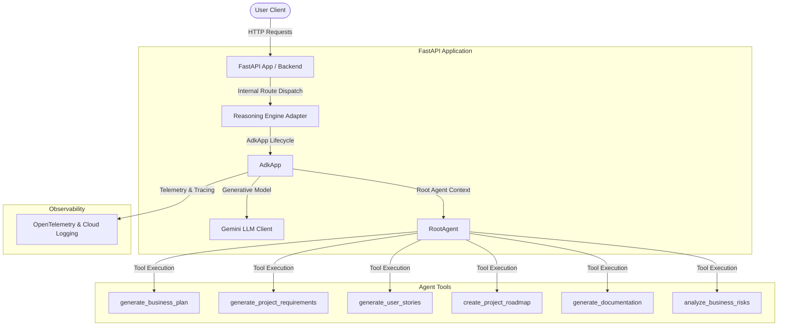

# sprintpilot-ai

An autonomous business operations assistant powered by the Google Agent Development Kit (ADK) that helps startup founders, ecommerce businesses, and software teams plan, organize, and execute their projects.

## Prerequisites

Before running the project, ensure you have:
*   **Python 3.11+** installed.
*   **uv**: The high-performance Python package installer and manager.
*   **Gemini API Key**: Obtain a free API key from [aistudio.google.com/apikey](https://aistudio.google.com/apikey).

## Quick Start

```bash
# Clone the repository
git clone <repo-url>
cd sprintpilot-ai

# Set up local configuration
cp .env.example .env   # edit .env and configure your GOOGLE_API_KEY / GEMINI_API_KEY

# Install dependencies
make install

# Launch the local playground
make playground        # opens the interactive developer UI at http://localhost:18081
```

---

## Architecture Diagram

The diagram below outlines the components of `sprintpilot-ai` and how requests flow through the application:




---

## How to Run

You can run the project in two different modes:
*   **Playground Mode:** Run `make playground` to start the local developer playground server. Access the interactive user interface in your browser at [http://localhost:18081/dev-ui/?app=app](http://localhost:18081/dev-ui/?app=app).
*   **Web Server Mode:** Run `make run` to spin up the local FastAPI web server at [http://localhost:8000](http://localhost:8000).

---

## Sample Test Cases

Here are 3 specific test cases you can execute in the local playground or web server:

### 1. Generating a Business Plan Outline
*   **Input:** `"Can you generate a business plan for Acme Corp in the SaaS industry targeting developers?"`
*   **Expected Behavior:** The `RootAgent` parses the request, invokes the `generate_business_plan` tool with the parameters `company_name="Acme Corp"`, `industry="SaaS"`, and `target_audience="developers"`, receives a structured business plan template, and returns it.
*   **Check:** In the playground UI, you will see a tool call block for `generate_business_plan`. The final response will show the generated markdown business plan.

### 2. Creating a Project Roadmap
*   **Input:** `"Create a 6-week project roadmap for my e-commerce storefront project."`
*   **Expected Behavior:** The `RootAgent` invokes the `create_project_roadmap` tool with parameters `project_name="e-commerce storefront"` and `duration_weeks=6`. The tool computes phase timelines and returns the roadmap.
*   **Check:** The UI displays the tool call logs for `create_project_roadmap` and shows a structured 6-week timeline with phases.

### 3. Business Risk Analysis
*   **Input:** `"Analyze business risks for Stripe in the payments space."`
*   **Expected Behavior:** The `RootAgent` routes the request to the `analyze_business_risks` tool with `company_name="Stripe"` and `industry="payments"`. The tool returns a risk analysis report with mitigations.
*   **Check:** The user sees the generated risk report listing market, operational, and compliance risks for Stripe.

---

## Troubleshooting

### 1. NameError: name `_default_instrumentor_builder` is not defined
*   **Cause:** The telemetry module is missing the import statement for the internal telemetry builder.
*   **Fix:** Ensure that `_default_instrumentor_builder` is imported from `vertexai.agent_engines.templates.adk` inside the `try` block in [telemetry.py](file:///c:/Users/Anshu%20Gupta/Desktop/adk-workspace/sprintpilot-ai/app/app_utils/telemetry.py#L71).

### 2. ValueError: Cannot encode value: `<fastapi.responses.StreamingResponse object>`
*   **Cause:** Using namespaces like `responses.StreamingResponse` in route type hints causes FastAPI to construct a validation model for it instead of recognizing it as a direct Response subclass.
*   **Fix:** Explicitly import `StreamingResponse` and `JSONResponse` from `fastapi.responses` in [reasoning_engine_adapter.py](file:///c:/Users/Anshu%20Gupta/Desktop/adk-workspace/sprintpilot-ai/app/app_utils/reasoning_engine_adapter.py#L28) and use them directly in type annotations.

### 3. RESOURCE_EXHAUSTED / 429 Too Many Requests
*   **Cause:** Rate limits or quotas for `generativelanguage.googleapis.com` have been exceeded on the free Gemini API tier.
*   **Fix:** Wait approximately 30-60 seconds for the current window to reset, or check billing settings/upgrade your plan in Google AI Studio.

---

## Assets

### Cover Page Banner


### Architecture Workflow Diagram


---

## Demo Script

A spoken presentation script with visual cues is available at [DEMO_SCRIPT.txt](file:///c:/Users/Anshu%20Gupta/Desktop/adk-workspace/sprintpilot-ai/DEMO_SCRIPT.txt) to guide you through a 3–4 minute walkthrough of the running project.

---

## Push to GitHub

1. Create a new repo at https://github.com/new
   - Name: sprintpilot-ai
   - Visibility: Public or Private
   - Do NOT initialize with README (you already have one)

2. In your terminal, navigate into your project folder:
   cd sprintpilot-ai
   git init
   git add .
   git commit -m "Initial commit: sprintpilot-ai ADK agent"
   git branch -M main
   git remote add origin https://github.com/uicoder1/sprintpilot-ai.git
   git push -u origin main

3. Verify .gitignore includes:
   .env          ← your API key — must NEVER be pushed
   .venv/
   __pycache__/
   *.pyc
   .adk/

⚠ NEVER push .env to GitHub. Your API key will be exposed publicly.
