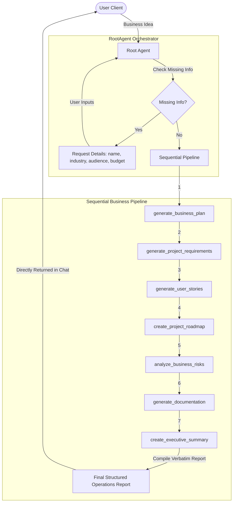

# SprintPilot AI 🚀

[](#)
[](#)
[](#)
[](#)

An Autonomous AI Business Operations Assistant built with Google Agent Development Kit (ADK), Gemini, FastAPI, and MCP-ready architecture.

---

## Project Overview

SprintPilot AI is designed to transform startup brainstorming and operations planning into a fully autonomous, production-ready pipeline. Rather than acting as a step-by-step chatbot that requires constant human prompting for every operational phase, SprintPilot AI acts as an execution controller. When given a high-level business idea, the assistant validates inputs, requests missing critical details, and then sequentially runs specialized agents to generate a complete business plan, engineering PRDs, User Stories, roadmaps, risk matrices, and executive reviews—delivering a consolidated operations portfolio verbatim.

---

## Business Problem

Developing a business concept requires months of planning, technical analysis, risk modeling, and requirements engineering. Startup founders, developers, and teams often spend significant time:
1. Writing detailed business plans.
2. Deriving software requirement specifications (SRS) and Agile User Stories.
3. Modeling timelines, epics, and engineering milestones.
4. Analyzing legal, security, financial, and technical risks.
5. Synthesizing summaries for stakeholders.

This process is slow, fragmented, and prone to communication gaps between business strategy and engineering execution.

---

## Solution

SprintPilot AI solves this bottleneck by modeling the operations lifecycle as a sequential agentic pipeline. It automates the transition from strategy to technical execution:
*   **Sequential Pipeline Execution:** Chains multiple domain-focused agent utilities autonomously without requiring human intervention between phases.
*   **Verbatim Outputs:** Prints complete, untruncated deliverables directly to the user client interface.
*   **Contextual Parameters:** Checks for and collects critical variables (name, industry, target customer, budget) up front and maintains them in persistent session memory.
*   **MCP Operations Hub:** Connects to filesystem, GitHub, Google Drive, Docs, and Calendar to push the generated plans directly to workspace folders and cloud environments.

---

## Architecture Diagram

The workflow below displays how SprintPilot AI routes incoming ideas, orchestrates specialized logic nodes, and synchronizes memory and MCP outputs:




---

## Features

*   **Autonomous Operation:** Automatically runs the entire business operations pipeline. No user commands needed for intermediate steps.
*   **Stateful Memory Preservation:** Recalls project names, target sectors, and previous timelines across user sessions.
*   **Model Context Protocol (MCP):**
    *   **Filesystem:** Reads/writes local workspace assets.
    *   **GitHub:** Instantly posts issues and roadmaps.
    *   **Google Drive/Docs:** Uploads generated reports to cloud files.
    *   **Google Calendar:** Pins milestones directly to project calendars.
*   **Live Visual Log Status:** Visualizes pipeline progress using terminal emojis.

---

## Tech Stack

*   **Core Logic:** Google Agent Development Kit (ADK) 2.0
*   **Generative AI:** Gemini 2.5 Flash Lite (optimized for fast reasoning and robust free-tier caps)
*   **Web Framework:** FastAPI, Uvicorn
*   **Environment & Dependency Management:** uv
*   **Validation:** Pydantic v2

---

## Folder Structure

```text
sprintpilot-ai/
├── app/
│   ├── app_utils/
│   │   ├── mcp_client.py                 # MCP Server Client Manager
│   │   ├── reasoning_engine_adapter.py    # FastAPI web adapter
│   │   └── telemetry.py                  # Telemetry builder
│   ├── tools/
│   │   ├── __init__.py                   # Tools package exposure
│   │   ├── business_plan.py              # Business plan generator
│   │   ├── business_risks.py             # Risk matrices assessment
│   │   ├── documentation.py              # Markdown document compiler
│   │   ├── executive_summary.py          # Executive VC synthesis
│   │   ├── orchestrator_workflow.py      # Core sequential pipeline runner
│   │   ├── project_requirements.py       # Engineering requirement extractor
│   │   ├── project_roadmap.py            # Epic & milestone scheduler
│   │   └── user_stories.py               # Agile user story builder
│   ├── agent.py                          # RootAgent configuration
│   ├── config.py                         # Environment variables mapping
│   └── main.py                           # FastAPI application entrypoint
├── assets/
│   ├── architecture_diagram.png          # System architecture visualizer
│   └── cover_page_banner.png             # Project title banner
├── tests/
│   ├── integration/                      # Agent interface tests
│   └── unit/                             # Test frameworks
├── pyproject.toml                        # Project config & dependencies
└── README.md                             # Project documentation
```

---

## Installation & Running Locally

Ensure you have **Python 3.11+** and **uv** installed.

```bash
# 1. Clone the project
git clone https://github.com/uicoder1/sprintpilot-ai.git
cd sprintpilot-ai

# 2. Set up environment variables
cp .env.example .env
# Edit .env and configure your GOOGLE_API_KEY / GEMINI_API_KEY

# 3. Install packages and set up virtual environment
make install

# 4. Launch local playground interface
make playground
# Open http://localhost:18081/dev-ui/?app=app in your browser
```

---

## Deployment

SprintPilot AI is fully compatible with production-grade containers.

1. **Build Docker Image:**
   ```bash
   docker build -t sprintpilot-ai .
   ```
2. **Run Container:**
   ```bash
   docker run -p 8000:8000 --env-file .env sprintpilot-ai
   ```

---

## Future Improvements

*   **Parallel Execution Nodes:** Optimize execution speed by running non-dependent steps (like Risk Analysis and Roadmap scheduling) in parallel.
*   **External Database Sync:** Support PostgreSQL/Redis integrations to maintain session context indefinitely for massive teams.
*   **Custom Templates:** Allow teams to upload their own layout templates for PRDs and roadmaps.

---

## License

This project is licensed under the Apache 2.0 License. See the LICENSE file for details.
