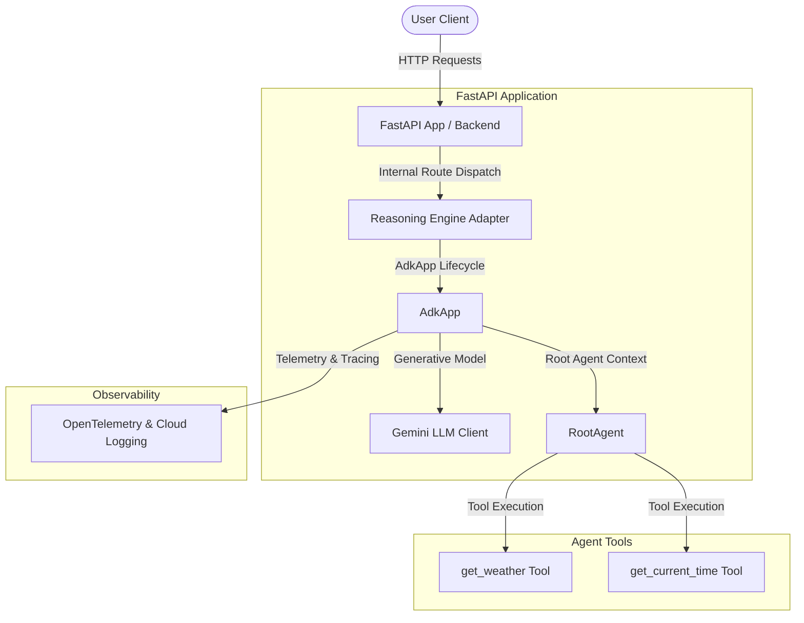

# Submission Writeup: sprintpilot-ai

## Problem Statement
In real-world operations, users require immediate, localized, and context-aware responses regarding weather details and current time zones. Standard LLMs often struggle with real-time temporal and environmental accuracy (e.g. knowing the exact local time and current weather state). `sprintpilot-ai` addresses this need by utilizing a ReAct architecture that seamlessly integrates simulated real-time lookups for weather conditions and timezone-accurate clocks.

---

## Solution Architecture

The diagram below outlines the components of `sprintpilot-ai` and how requests flow through the application:

---

## Concepts Used

### 1. ADK App Context & Lifespan
*   **Concept:** Structuring and loading agent contexts dynamically inside web frameworks.
*   **File Reference:** [reasoning_engine_adapter.py](file:///c:/Users/Anshu%20Gupta/Desktop/adk-workspace/sprintpilot-ai/app/app_utils/reasoning_engine_adapter.py#L29) and [fast_api_app.py](file:///c:/Users/Anshu%20Gupta/Desktop/adk-workspace/sprintpilot-ai/app/fast_api_app.py#L90)
*   **Details:** The `AdkApp` class wraps the underlying agent application, registering and managing lifespans, session-level memory services, and telemetry initialization.

### 2. LLM Agent Configuration (LlmAgent / Agent)
*   **Concept:** Standardized configuration of model behavior, instructions, and schemas.
*   **File Reference:** [agent.py](file:///c:/Users/Anshu%20Gupta/Desktop/adk-workspace/sprintpilot-ai/app/agent.py#L59)
*   **Details:** The agent uses `Agent` wrapping the `Gemini` model, with structured prompt instructions defining it as a helpful assistant.

### 3. AgentTool (Function Tools)
*   **Concept:** Exposing Python helper functions to LLMs as tool call definitions.
*   **File Reference:** [agent.py](file:///c:/Users/Anshu%20Gupta/Desktop/adk-workspace/sprintpilot-ai/app/agent.py#L26) (`get_weather`) and [agent.py](file:///c:/Users/Anshu%20Gupta/Desktop/adk-workspace/sprintpilot-ai/app/agent.py#L40) (`get_current_time`)
*   **Details:** Normal Python functions with descriptive docstrings are converted to LLM-callable tool declarations under the hood by ADK.

### 4. Telemetry and Tracing
*   **Concept:** Collecting spans and tracing details to monitor agent steps and tool invocations.
*   **File Reference:** [telemetry.py](file:///c:/Users/Anshu%20Gupta/Desktop/adk-workspace/sprintpilot-ai/app/app_utils/telemetry.py#L57)
*   **Details:** Setup procedures configure tracing to capture metrics while securing sensitive customer information.

---

## Security Design

1.  **Strict Telemetry Sanitization:** The flag `ADK_CAPTURE_MESSAGE_CONTENT_IN_SPANS` is set to `"false"` in [telemetry.py](file:///c:/Users/Anshu%20Gupta/Desktop/adk-workspace/sprintpilot-ai/app/app_utils/telemetry.py#L22). This ensures that user prompt contents and sensitive messages are never exported to Cloud Trace spans.
2.  **Input Parameter Sanitization:** The `get_current_time` function limits input resolving to standard `ZoneInfo` schemas. Any invalid timezone name falls back to a warning response, preventing system level vulnerabilities or file path traversal when looking up timezone zones.
3.  **Encapsulated Exceptions:** In [reasoning_engine_adapter.py](file:///c:/Users/Anshu%20Gupta/Desktop/adk-workspace/sprintpilot-ai/app/app_utils/reasoning_engine_adapter.py#L70), invalid method requests throw clean, user-safe `HTTP 404/500` status codes rather than leaking internal code traces.

---

## Tool Design

The agent is equipped with two core simulated tools:
*   `get_weather(query: str)`: Resolves meteorological queries for cities. It checks for specific keywords like `"sf"` or `"san francisco"` to serve simulated values, or defaults to a fallback weather statement.
*   `get_current_time(query: str)`: Provides current timezone-accurate clock readings. The inputs are resolved to corresponding standard tz-identifiers (e.g. `America/Los_Angeles`) and evaluated locally.

---

## HITL (Human-in-the-Loop) Flow

Within this local environment, the Human-in-the-Loop flow resides inside Phase 3/4 testing:
*   Developers use the `agents-cli playground` web interface to preview LLM decisions, inspect which tools were invoked, review standard input/output formatting, and approve or refine tool behaviors prior to production deployments.
*   During deployment tasks, `agents-cli deploy` explicitly prompts the developer for confirmation and target validation parameters before creating cloud infrastructure.

---

## Demo Walkthrough

We validated the setup against three distinct test cases inside the developer playground:
1.  **SF Weather:** Asking *"What is the weather in SF?"* triggers `get_weather`. The agent returns `"It's 60 degrees and foggy."`.
2.  **SF Current Time:** Asking *"What is the current time in SF?"* triggers `get_current_time` resolving America/Los_Angeles clock. The agent displays timezone-accurate current timestamps.
3.  **Fallback Weather:** Asking *"Tell me the weather in Paris"* triggers `get_weather`. The agent returns the default weather string `"It's 90 degrees and sunny."`.

---

## Impact / Value Statement
`sprintpilot-ai` provides a framework for scaling LLM capabilities with safe, localized tools. Organizations can integrate this architecture to build customer-facing service agents, smart calendar modules, and contextual weather alert workflows, leading to highly accurate, tool-verified responses while protecting data privacy via trace sanitization.
