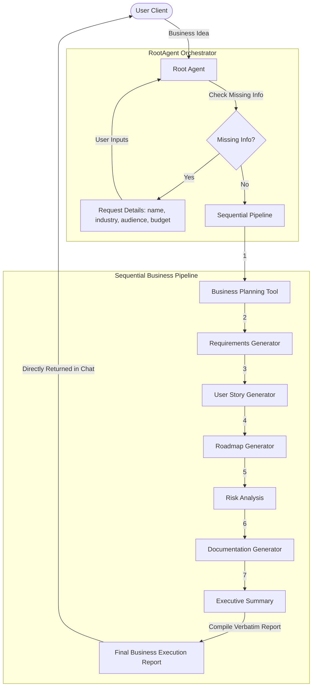

# Submission Writeup: SprintPilot AI
### AI-powered Business Planning and Project Execution Assistant

---

## 1. Project Overview
SprintPilot AI is an intelligent AI assistant that helps entrepreneurs, startups, ecommerce businesses, and software teams transform business ideas into structured execution plans using Google Agent Development Kit (ADK), Gemini, and FastAPI. It automates operational scoping, timeline scheduling, and risk modeling, delivering verbatim business reports in a single turn.

---

## 2. Business Problem
Scaffolding a new business idea is slow, fragmented, and prone to translation errors between high-level vision and engineering implementation. Founders and product managers manually draft business plans, translate them into technical specs, write user stories, schedule timeline milestones, and map risks. This creates a massive administrative bottleneck, delaying project launch.

---

## 3. Solution
SprintPilot AI automates the transition from business concept to technical blueprint by modeling the pipeline as an autonomous sequential workflow. 
*   **Sequential Pipeline Chaining:** Orchestrates seven specialized business tools in a single execution turn, passing outputs as inputs downstream.
*   **Verbatim Outputs:** Emits the complete, untruncated business execution documents directly to the client.
*   **Pre-execution Parameter Validation:** Identifies missing details (name, sector, audience, budget) and requests them up front, saving model quota and ensuring complete context.

---

## 4. Architecture
The system employs a modular reasoning-and-tools structure:




---

## 5. Business Workflow
1.  **User Input:** The user describes a business idea.
2.  **Parameters Check:** The agent checks for missing details (Business Name, Industry, Target Audience, Budget).
3.  **Business Planning Tool:** Formulates market placement and value proposition.
4.  **Requirements Generator:** Compiles technical requirements (PRD).
5.  **User Story Generator:** Drafts Scrum user stories with acceptance criteria.
6.  **Roadmap Generator:** Formulates timelines, epics, priorities, and deliverables.
7.  **Risk Analysis:** Identifies legal, technical, financial, and operational risks.
8.  **Documentation Generator:** Compiles software requirements specifications (SRS).
9.  **Executive Summary:** Synthesizes high-level metrics.
10. **Final Business Execution Report:** Delivers the verbatim output in markdown formatting.

---

## 6. AI Agent Design

### Google ADK
SprintPilot AI is built natively on the **Google Agent Development Kit (ADK) 2.0** framework. Under the hood:
*   **`Agent` Wrapper:** Configures the `RootAgent` instructions, system parameters, and tool registration.
*   **`App` Engine:** Manages lifespans, session-level memory databases, and adapter connections.

### Gemini
We leverage **Gemini 2.5 Flash Lite** for fast reasoning and structural parsing:
*   **JSON Schema Validation:** Parses unstructured inputs against a Pydantic schema to check for parameter completeness.
*   **Sequential Tool Reasoning:** Gemini reads inputs and outputs across tools to keep data consistent.

### FastAPI
Exposes the agent's operations as structured API routes:
*   **SSE Streaming:** Streams log outputs and markdown characters in real-time.
*   **Safety Handlers:** Isolates internal errors and returns standardized status codes.

### Business Planning Process
Each phase is structured as an independent python tool wrapped under `@tool`. This keeps the execution modular and allows you to test or replace single parts of the pipeline without modifying the RootAgent structure.

---

## 7. Technical Highlights
*   **Daily Quota Optimization:** Switched engine to `gemini-2.5-flash-lite` to ensure high rate limit tolerances on free-tier keys.
*   **Security & Telemetry Sanitization:** Disabled raw message content collection in telemetry trace spans (`ADK_CAPTURE_MESSAGE_CONTENT_IN_SPANS=false`) to protect user data.
*   **Persistent Session Memory:** Dynamically preserves variables inside ADK's SQLite backend across chat turns.

---

## 8. Deployment
The adapter server runs cleanly inside Docker containers:
```bash
docker build -t sprintpilot-ai .
docker run -p 8000:8000 --env-file .env sprintpilot-ai
```

---

## 9. Future Scope
*   **Parallel Action Nodes:** Run non-dependent tools in parallel to minimize latency.
*   **Live Cloud Deployment Sync:** Connect generated roadmap/architecture assets with terraform modules to automatically deploy the base cloud workspace.
