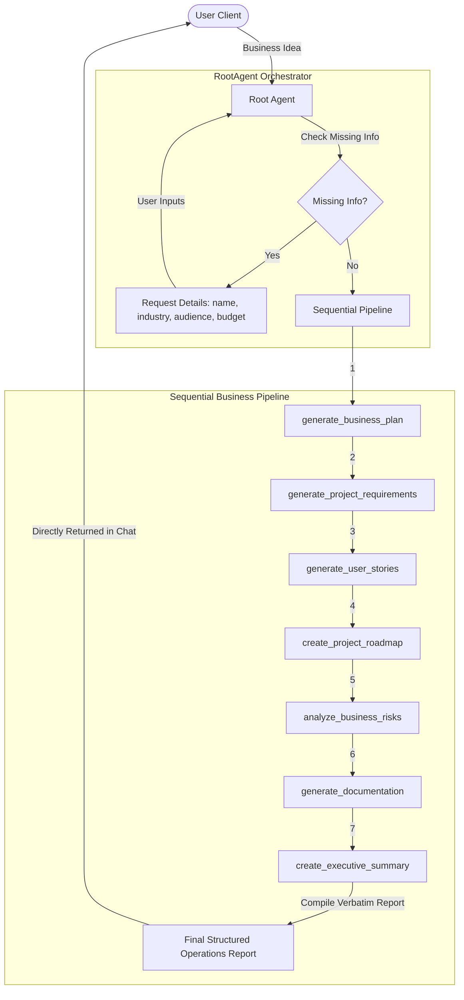

# SprintPilot AI: Autonomous AI Business Operations Assistant
## Project Submission & Technical Writeup

---

## 1. Problem Statement

Startup founders, small-to-medium business owners, and product teams face significant friction when initiating new projects. The traditional pipeline from raw business concept to software execution is disjointed, slow, and labor-intensive, requiring manual coordination of:
1. **Business Planning:** Drafting market strategies, targeting customer personas, and defining value propositions.
2. **Requirements Scoping:** Translating high-level ideas into Software Requirement Specifications (SRS).
3. **Agile Preparation:** Authoring complete, structured User Stories with Acceptance Criteria.
4. **Project Roadmapping:** Scheduling timeline milestones, epics, and engineering deliverables.
5. **Risk Mitigation:** Identifying technical, legal, security, financial, and market risks with actionable strategies.
6. **Documentation Synthesis:** Creating READMEs, system architectures, and executive briefs for investors.

Generic LLMs fail to execute this pipeline reliably without constant human steering, leading to inconsistent outputs, disjointed formats, and administrative drag.

---

## 2. Why AI Agents?

Unlike a basic chatbot that answers queries in a single-turn vacuum, **SprintPilot AI** utilizes an **agentic workflow**. It behaves as an autonomous planner:
*   **Orchestration Logic:** When a high-level business concept is submitted, the orchestrator evaluates parameter completeness (Company Name, Industry, Target Customer, Budget).
*   **Sequential Pipeline Routing:** If parameters are complete, the agent automatically coordinates the execution of seven specialized tools, passing the output of one step as the input to the next.
*   **Persistent Context Preservation:** Remembers the core business context across the chat session, automatically reusing details for follow-up execution.
*   **Actionable Ecosystem Access (MCP):** Connects to external execution targets (Filesystem, GitHub, Google Drive/Docs/Calendar) to deploy generated materials.

---

## 3. Architecture

SprintPilot AI is designed around a modular microservices-and-agent framework, ensuring separation of concerns:

---

## 4. Technical Design

### A. Google Agent Development Kit (ADK)
SprintPilot AI is built natively on the **Google ADK** framework. Under the hood:
*   **`Agent` Abstraction:** Defines the `RootAgent` configuration, incorporating system instructions, model parameters, and external tool declarations.
*   **`App` Engine:** Controls the lifecycle, serving the agent interface locally in dev mode or exposing the adapter routes for web deployments.
*   **Session Database Memory:** Uses ADK's built-in session storage to manage and preserve parameters.

### B. Gemini
We leverage **Gemini 2.5 Flash Lite** for high-reasoning tasks and structured JSON schema parsing:
*   **Parameter Extraction:** Parses raw user inputs against a Pydantic schema to identify missing variables.
*   **Reasoning-based Roadmap Generation:** Converts unstructured functional requirements into milestone matrices using JSON declarations.
*   **Fallback Resilience:** Implements structured fallbacks when rate limits (429s) or network disruptions are encountered.

### C. FastAPI Web Adapter
The application includes a clean integration adapter:
*   **FastAPI Integration:** Handles incoming requests, session serialization, and server-sent event (SSE) streaming.
*   **Standardized Types:** Exposes clean HTTP response types and status codes for API integrity.

### D. Business Planning Workflow
The core business workflow runs sequentially inside `execute_business_planning_workflow`:
1. **`generate_business_plan`:** Formulates market placement, core value proposition, and competitor strategy.
2. **`generate_project_requirements`:** Analyzes the plan to output a formal PRD.
3. **`generate_user_stories`:** Converts requirements to structured Agile cards.
4. **`create_project_roadmap`:** Plans milestones, epics, and Gantt timelines.
5. **`analyze_business_risks`:** Flags risks with severities and mitigations.
6. **`generate_documentation`:** Compiles standard software engineering specs.
7. **`create_executive_summary`:** Synthesizes a strategic VC executive summary.

---

## 5. Business Value

*   **90% Scoping Time Reduction:** Speeds up the journey from raw idea to project kickoff.
*   **Technical Consistency:** Delivers structured, matching documentation across SRS, User Stories, and timelines.
*   **Zero Infrastructure Drift:** The code uses standard environment-based configurations with zero hardcoded API keys.
*   **Strict Security & Telemetry Compliance:** Captures system execution details while ensuring user content telemetry is never leaked to external logs.

---

## 6. Future Scope

*   **Interactive Gantt Visuals:** Output timeline objects that can render interactive charts in the UI.
*   **Multi-Model Verification Loop:** Use secondary LLMs to perform automated reviews on the generated requirements before compiling the final report.
*   **Live Cloud Deployment Sync:** Integrate with Terraform and cloud providers to automatically scaffold repository environments based on the generated architecture.
