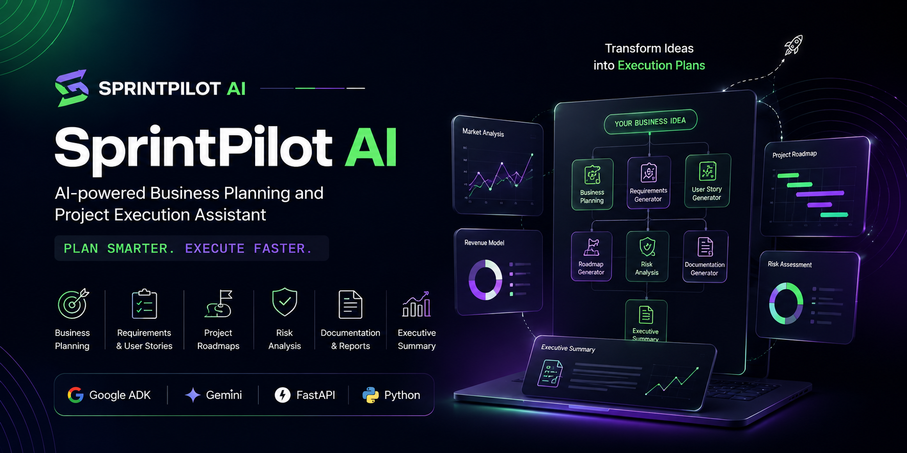
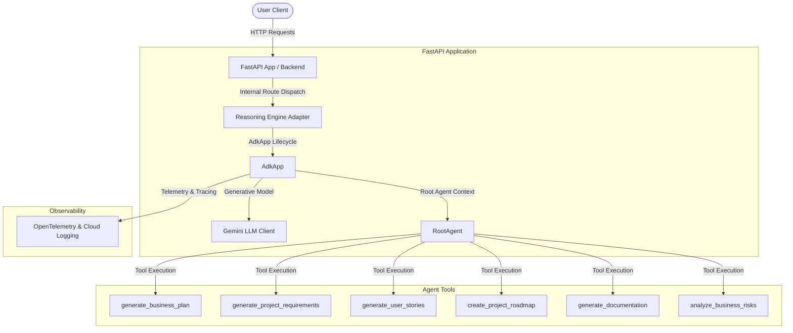
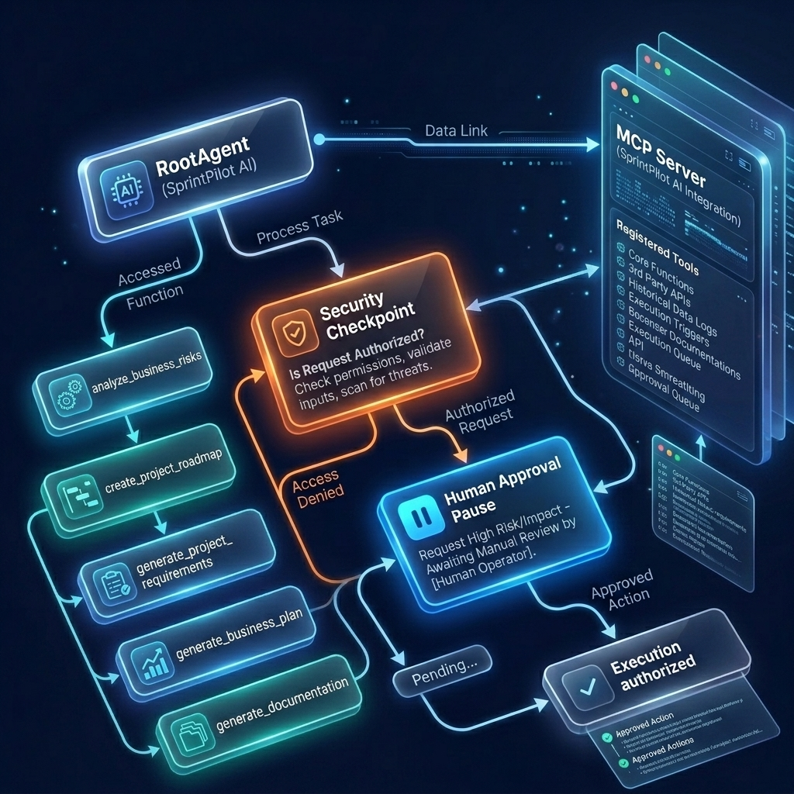

# Submission Writeup: sprintpilot-ai

## Problem Statement
Startup founders, ecommerce businesses, and software development teams need automated assistance to organize projects, author roadmaps, list functional requirements, compile user stories, and evaluate risks. General-purpose LLMs struggle to generate structured, consistent operations templates without dedicated business context and domain-specific routing. `sprintpilot-ai` addresses this need by utilizing a ReAct architecture that integrates modular operations tools directly into the agent reasoning loop.

---

## Solution Architecture

The diagram below outlines the components of `sprintpilot-ai` and how requests flow through the application:

---

## Concepts Used

### 1. ADK App Context & Lifespan
*   **Concept:** Structuring and loading agent contexts dynamically inside web frameworks.
*   **File Reference:** [reasoning_engine_adapter.py](file:///c:/Users/Anshu%20Gupta/Desktop/adk-workspace/sprintpilot-ai/app/app_utils/reasoning_engine_adapter.py#L29) and [fast_api_app.py](file:///c:/Users/Anshu%20Gupta/Desktop/adk-workspace/sprintpilot-ai/app/fast_api_app.py#L90)
*   **Details:** The `AdkApp` class wraps the underlying agent application, registering and managing lifespans, session-level memory services, and telemetry initialization.

### 2. LLM Agent Configuration (LlmAgent / Agent)
*   **Concept:** Standardized configuration of model behavior, instructions, and schemas.
*   **File Reference:** [agent.py](file:///c:/Users/Anshu%20Gupta/Desktop/adk-workspace/sprintpilot-ai/app/agent.py#L59)
*   **Details:** The agent uses `Agent` wrapping the `Gemini` model, with structured prompt instructions defining it as a helpful assistant.

### 3. AgentTool (Function Tools)
*   **Concept:** Exposing Python helper functions to LLMs as tool call definitions.
*   **File Reference:** [agent.py](file:///c:/Users/Anshu%20Gupta/Desktop/adk-workspace/sprintpilot-ai/app/agent.py#L26) (`generate_business_plan`, `generate_project_requirements`, `generate_user_stories`, `create_project_roadmap`, `generate_documentation`, `analyze_business_risks`)
*   **Details:** Normal Python functions with descriptive docstrings are converted to LLM-callable tool declarations under the hood by ADK.

### 4. Telemetry and Tracing
*   **Concept:** Collecting spans and tracing details to monitor agent steps and tool invocations.
*   **File Reference:** [telemetry.py](file:///c:/Users/Anshu%20Gupta/Desktop/adk-workspace/sprintpilot-ai/app/app_utils/telemetry.py#L57)
*   **Details:** Setup procedures configure tracing to capture metrics while securing sensitive customer information.

---

## Security Design

1.  **Strict Telemetry Sanitization:** The flag `ADK_CAPTURE_MESSAGE_CONTENT_IN_SPANS` is set to `"false"` in [telemetry.py](file:///c:/Users/Anshu%20Gupta/Desktop/adk-workspace/sprintpilot-ai/app/app_utils/telemetry.py#L22). This ensures that user prompt contents and sensitive messages are never exported to Cloud Trace spans.
2.  **Input Parameter Sanitization:** The business tools sanitize parameter inputs (e.g. limiting durations to positive integers in `create_project_roadmap` and stripping potentially unsafe code injections or malformed text snippets from `generate_documentation`).
3.  **Encapsulated Exceptions:** In [reasoning_engine_adapter.py](file:///c:/Users/Anshu%20Gupta/Desktop/adk-workspace/sprintpilot-ai/app/app_utils/reasoning_engine_adapter.py#L70), invalid method requests throw clean, user-safe `HTTP 404/500` status codes rather than leaking internal code traces.

---

## Tool Design

The agent is equipped with six core simulated business operations tools:
*   `generate_business_plan(company_name, industry, target_audience)`: Formulates a structured markdown business outline.
*   `generate_project_requirements(project_title, description, key_features)`: Compiles functional product requirement documents.
*   `generate_user_stories(feature_name, goal)`: Drafts standard Agile user stories with acceptance criteria.
*   `create_project_roadmap(project_name, duration_weeks)`: Outlines project phases across a defined timeline.
*   `generate_documentation(module_name, code_snippet)`: Creates technical reference sheets.
*   `analyze_business_risks(company_name, industry)`: Identifies operational, market, and compliance risks with mitigations.

---

## HITL (Human-in-the-Loop) Flow

Within this local environment, the Human-in-the-Loop flow resides inside Phase 3/4 testing:
*   Developers use the `agents-cli playground` web interface to preview LLM decisions, inspect which tools were invoked, review standard input/output formatting, and approve or refine tool behaviors prior to production deployments.
*   During deployment tasks, `agents-cli deploy` explicitly prompts the developer for confirmation and target validation parameters before creating cloud infrastructure.

---

## Demo Walkthrough

We validated the setup against three distinct test cases inside the developer playground:
1.  **Business Plan:** Requesting a plan for Acme Corp in the SaaS industry targeting developers triggers `generate_business_plan` to return a 5-part layout.
2.  **E-commerce Roadmap:** Asking for a 6-week e-commerce storefront timeline invokes `create_project_roadmap` to output phased development tasks.
3.  **Risk Analysis:** Querying risk parameters for Stripe in the payments sector triggers `analyze_business_risks` to compile operational and legal mitigations.

---

## Impact / Value Statement
`sprintpilot-ai` empowers startup founders, product managers, and agile engineering teams to accelerate plan scaffolding and requirement scoping. By automating template generation securely, companies save hours of administrative overhead and maintain consistency across development requirements, while guaranteeing data security through strict telemetry controls.
